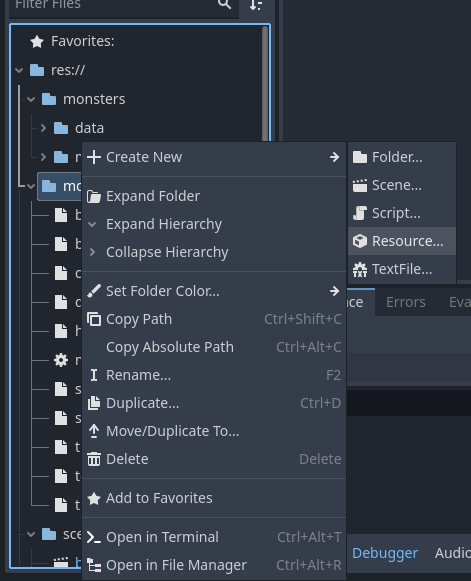
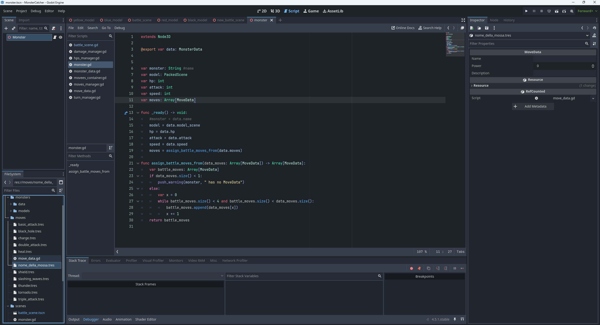
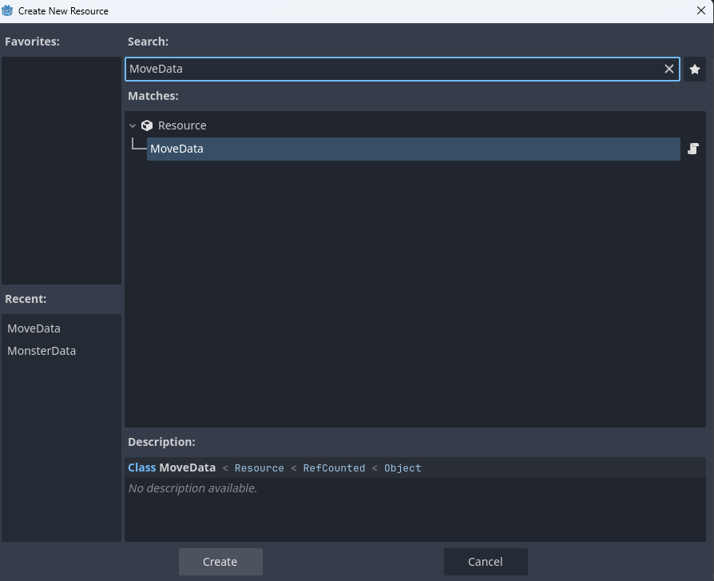

# Moves

Per il momento abbiamo deciso di mettere 4 mosse per ogni Astral.

Le mosse per il momento hanno le seguenti caratteristiche:

Nome, Potenza, Descrizione

Nel Battle System sto implementando i turni, appena sono implementati a dovere avranno anche la caratteristica Cooldown (le mosse a cooldown 1 turno, posso essere usate tutti i turni)

Successivamente avranno anche la caratteristica Elemento, quando verranno implementati negli Astral.

E ovviamente potranno applicare status, come aumento attacco, cura, veleno ecc

### Come creare una mossa?

Posizionarsi nella cartella moves, cliccare con il destro Create New/Resource

Scegliere il tipo di risorsa MoveData

Dare un nome al file (possibilmente usando il seguente formato: nome_della_mossa.tres)

Fare due click sul nuovo file creato all’interno della cartella moves.

E nel lato destro dell’engine (Inspector) possiamo modificare tutti i parametri implementati per le mosse

